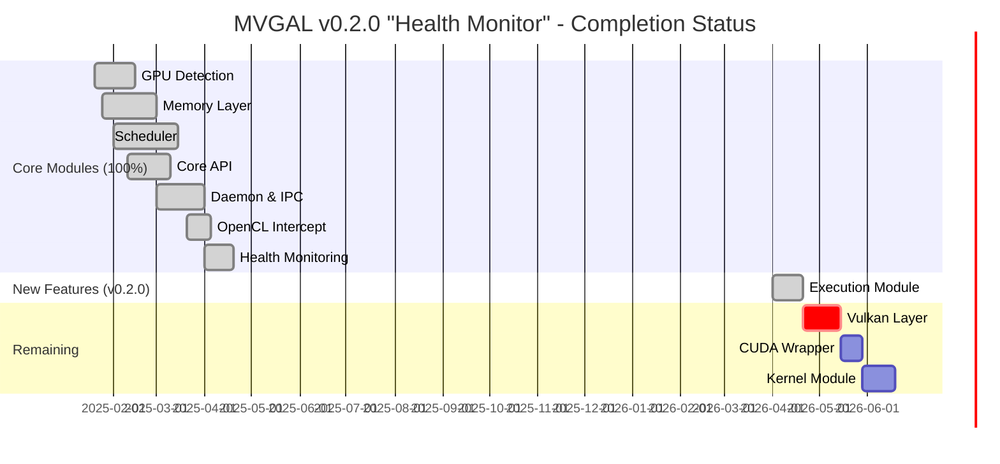

# Contributing to MVGAL


**Thank you for your interest in contributing to the Multi-Vendor GPU Aggregation Layer for Linux (MVGAL)!**

---

## 📋 Project Overview

MVGAL is an open-source project that enables heterogeneous GPUs (AMD, NVIDIA, Intel, Moore Threads) to function as a single logical compute and rendering device. The project is written in **C11** (with some C17 features in CMake) and targets **Linux systems** (Kernel 5.4+ recommended, 6.0+ for best experience).

### 🎯 Current Status

| Aspect | Status |
|--------|--------|
| **Version** | 0.2.0 "Health Monitor" |
| **Completion** | ~92% |
| **License** | GPLv3 |
| **Primary Language** | C11 |
| **Platform** | Linux |

---

## 🛠️ Development Setup

## Prerequisites

### 📦 Prerequisites

| Requirement | Minimum | Recommended | Notes |
|-------------|---------|-------------|-------|
| **Linux Kernel** | 5.4+ | 6.0+ | Required for full DMA-BUF support |
| **GCC/Clang** | 11+ | 13+ | C11 support required |
| **CMake** | 3.16+ | 3.20+ | For build system |
| **libdrm** | 2.4.100+ | latest | DRM device access |
| **libpci** | latest | latest | PCI bus enumeration |
| **libudev** | latest | latest | Device detection |
| **Vulkan SDK** | 1.3+ | latest | Optional (for Vulkan layer) |
| **OpenCL** | 2.0+ | latest | Optional (for OpenCL interception) |

### 🐧 Distribution-Specific Setup

#### Ubuntu/Debian (22.04 LTS or newer)
```bash
# Update package lists
sudo apt update

# Install core build dependencies
sudo apt install -y git build-essential cmake pkg-config ccache \
    libdrm-dev libpci-dev libudev-dev libsystemd-dev

# Optional: Vulkan and OpenCL support
sudo apt install -y vulkan-tools libvulkan-dev \
    opencl-headers ocl-icd-dev ocl-icd-opencl-dev

# Optional: GUI development
sudo apt install -y libgtk-3-dev libglib2.0-dev
```

#### Fedora/RHEL/CentOS
```bash
# Install core build dependencies
sudo dnf install -y git gcc gcc-c++ make cmake pkgconfig ccache \
    libdrm-devel libpci-devel systemd-devel

# Optional: Vulkan and OpenCL support
sudo dnf install -y vulkan-devel opencl-headers ocl-icd-devel

# Optional: GUI development
sudo dnf install -y gtk3-devel glib2-devel
```

#### Arch Linux
```bash
# Install core build dependencies
sudo pacman -S git gcc make cmake pkgconf ccache \
    libdrm libpci systemd

# Optional: Vulkan and OpenCL support
sudo pacman -S vulkan-devel opencl-headers ocl-icd

# Optional: GUI development
sudo pacman -S gtk3
```

---

## 🚀 Building MVGAL

### Quick Start

```bash
# Clone the repository
.git clone https://github.com/TheCreateGM/mvgal.git
cd mvgal

# Create and enter build directory
mkdir -p build && cd build

# Configure with default options (recommended)
cmake -DWITH_VULKAN=OFF -DWITH_TESTS=ON ..

# Or configure with all features
cmake -DWITH_VULKAN=ON -DWITH_OPENCL=ON -DWITH_TESTS=ON ..

# Build with all CPU cores
make -j$(nproc)

# Run tests
ctest --output-on-failure
# Or for verbose output:
ctest -V
```

### Build Options

| CMake Flag | Default | Description |
|-----------|---------|-------------|
| `WITH_VULKAN` | OFF | Build Vulkan interception layer |
| `WITH_OPENCL` | ON | Build OpenCL interception layer |
| `WITH_CUDA` | OFF | Build CUDA wrapper (experimental) |
| `WITH_DAEMON` | ON | Build MVGAL daemon |
| `WITH_TESTS` | ON | Build test suite |
| `WITH_BENCHMARKS` | OFF | Build benchmark suite |
| `WITH_DEBUG` | OFF | Debug build with symbols |
| `WITH_ASAN` | OFF | AddressSanitizer (debug only) |
| `WITH_UBSAN` | OFF | UndefinedBehaviorSanitizer (debug only) |
| `WITH_TSAN` | OFF | ThreadSanitizer (debug only) |

**Recommended Configuration:**
```bash
# Default: Only vulkan disabled (most compatible)
cmake -DWITH_VULKAN=OFF ..

# Full: All features (requires Vulkan SDK)
cmake -DWITH_VULKAN=ON ..

# Debug: With sanitizers
cmake -DWITH_DEBUG=ON -DWITH_ASAN=ON ..
```

---

## 🗂️ Project Structure

```
mvgal/
├── include/mvgal/                          # Public API headers
│   ├── mvgal.h                  # Main public API
│   ├── mvgal_types.h             # Type definitions
│   ├── mvgal_gpu.h               # GPU management API (+ Health Monitoring)
│   ├── mvgal_memory.h            # Memory management API
│   ├── mvgal_scheduler.h         # Scheduler API
│   ├── mvgal_log.h               # Logging API
│   ├── mvgal_config.h            # Configuration API
│   ├── mvgal_ipc.h               # IPC communication API
│   └── mvgal_version.h           # Version information
│
├── src/userspace/                         # Userspace components
│   ├── api/                           # Core API implementations
│   │   ├── mvgal_api.c               # Main API implementation
│   │   └── mvgal_log.c               # Logging implementation (22 functions)
│   │
│   ├── daemon/                        # Daemon and support
│   │   ├── main.c                    # Daemon entry point
│   │   ├── gpu_manager.c             # GPU detection & health monitoring
│   │   ├── config.c                  # Configuration management
│   │   └── ipc.c                     # Inter-process communication
│   │
│   ├── memory/                        # Memory abstraction layer
│   │   ├── memory.c                  # Core memory management
│   │   ├── dmabuf.c                  # DMA-BUF backend
│   │   ├── allocator.c               # Memory allocator
│   │   └── sync.c                    # Synchronization primitives
│   │
│   ├── scheduler/                     # Workload scheduling
│   │   ├── scheduler.c               # Main scheduler (1,383+ lines)
│   │   ├── load_balancer.c           # Load balancing logic
│   │   └── strategy/                 # Distribution strategies
│   │       ├── afr.c                 # Alternate Frame Rendering
│   │       ├── sfr.c                 # Split Frame Rendering
│   │       ├── task.c               # Task-based distribution
│   │       ├── compute_offload.c    # Compute offload strategy
│   │       └── hybrid.c              # Adaptive hybrid strategy
│   │
│   └── intercept/                     # API interception layers
│       ├── cuda/                    # CUDA wrapper
│       │   └── cuda_wrapper.c        # CUDA API interception (40+ functions)
│       ├── d3d/                     # Direct3D interception
│       │   └── d3d_wrapper.c         # D3D API interception
│       ├── metal/                   # Metal API interception
│       │   └── metal_wrapper.c       # Metal API interception
│       ├── opencl/                  # OpenCL interception
│       │   ├── cl_intercept.c        # OpenCL LD_PRELOAD wrapper
│       │   ├── cl_intercept.h        # OpenCL headers
│       │   └── cl_platform.c         # OpenCL platform layer
│       ├── vulkan/                  # Vulkan layer
│       │   ├── vk_layer.c           # Vulkan layer entry (compiles)
│       │   ├── vk_layer.h           # Vulkan layer headers
│       │   ├── vk_instance.c         # Instance management
│       │   ├── vk_device.c           # Device management
│       │   ├── vk_queue.c             # Queue management
│       │   └── vk_command.c          # Command buffer handling
│       └── webgpu/                  # WebGPU interception
│           └── webgpu_wrapper.c      # WebGPU API interception
│
├── src/kernel/                           # Kernel module (optional)
│   └── mvgal_kernel.c                 # Main kernel module
│
├── tests/                                # Test suite
│   ├── unit/                            # Unit tests
│   │   ├── test_core_api.c             # Core API tests
│   │   ├── test_gpu_detection.c        # GPU detection tests
│   │   ├── test_memory.c               # Memory tests
│   │   ├── test_scheduler.c            # Scheduler tests
│   │   └── test_config.c               # Configuration tests
│   └── integration/                     # Integration tests
│       └── test_multi_gpu_validation.c # Multi-GPU validation
│
├── pkg/                                  # Packaging
│   ├── debian/                         # Debian packages
│   ├── rpm/                            # RPM packages
│   ├── arch/                           # Arch Linux PKGBUILD
│   ├── flatpak/                        # Flatpak manifest
│   ├── snap/                           # Snap configuration
│   └── systemd/                        # systemd service
│
├── docs/                                # Documentation
│   ├── ARCHITECTURE_RESEARCH.md        # Architecture analysis
│   ├── PROGRESS.md                     # Development progress
│   ├── MISSING.md                      # Missing components
│   ├── STATUS.md                       # Project status
│   ├── CHANGES_2025.md                 # 2025 change log
│   ├── QUICKSTART.md                   # Quick start guide
│   ├── STEAM.md                        # Steam/Proton integration
│   ├── PACKAGING_SUMMARY.md            # Packaging overview
│   ├── BUILDworkspace.md               # Build guide
│   └── FINAL_COMPLETION.md             # Completion report
│
├── tools/                               # CLI tools
│   ├── mvgal-config.c                  # Configuration tool
│   └── Makefile                        # Build system
│
├── gui/                                 # GUI tools
│   ├── mvgal-gui.c                     # GTK configuration GUI
│   ├── mvgal-tray.c                    # System tray icon
│   └── Makefile                        # Build system
│
├── config/                              # Configuration files
│   ├── mvgal.conf                       # Default configuration
│   ├── 99-mvgal.rules                   # udev rules
│   └── icons/                           # Project icons
│
├── benchmarks/                          # Benchmark suite
│   ├── framework/                       # Benchmark framework
│   ├── synthetic/                       # Synthetic benchmarks
│   ├── real_world/                      # Real-world benchmarks
│   └── stress/                          # Stress tests
│
├── CMakeLists.txt                       # Main build configuration
├── README.md                            # Project documentation
└── LICENSE                              # GPLv3 license
```

---

## 📜 Coding Standards

We follow strict coding standards to maintain code quality:

### Language & Specification
- **Standard:** C11 (ISO/IEC 9899:2011)
- **Compiler:** GCC (tested with 11+), Clang (tested with 13+)
- **Extensions:** Limited C17 features allowed where supported

### Compiler Flags
All code must compile with **zero warnings** under:
```
-Wall -Wextra -Wpedantic -Wshadow -Wconversion -Wsign-conversion -Wformat=2
```

**_NOTE:** You can disable warnings to `-Werror` during development, but PRs must pass with `-Werror`.

### Code Quality Requirements
- ✅ **No warnings** with strict compiler flags
- ✅ **Thread-safe** - Use mutexes or atomics for shared state
- ✅ **Error handling** - All public APIs return proper error codes
- ✅ **Documentation** - Doxygen-style comments for all public APIs
- ✅ **Consistent style** - Match existing codebase formatting
- ✅ **Portable** - Linux-focused, avoid platform-specific code

### Style Guidelines
- Indentation: 4 spaces (NO tabs)
- Braces: Opening on same line, closing on new line
- Line length: Under 120 characters (soft limit)
- Functions: Prefix public APIs with module name (e.g., `mvgal_*`)
- Variables: Lowercase with underscores (snake_case)
- Constants: UPPERCASE with underscores
- Types: `typedef` for public types, use `_t` suffix

## 📊 Current Status Summary

### Completion Overview



### Module Completion Table

| Module | Status | Lines | Functions | Notes |
|--------|--------|-------|-----------|-------|
| **Core API** | ✅ Complete | 1,200+ | 27 | All public APIs working |
| **GPU Management** | ✅ Complete | 2,328+ | 28+ | + Health Monitoring |
| **Memory Module** | ✅ Complete | 2,576+ | 45 | DMA-BUF, P2P, UVM |
| **Scheduler** | ✅ Complete | 2,275+ | 34+ | 7 strategies |
| **Logging** | ✅ Complete | 400+ | 22 | Thread-safe, multi-target |
| **Daemon & IPC** | ✅ Complete | 796+ | 18+ | Unix socket based |
| **OpenCL Intercept** | ✅ Complete | ~20KB | - | LD_PRELOAD wrapper |
| **CUDA Wrapper** | ✅ Complete | ~1340 | 40+ | All intercepts working |
| **Vulkan Layer** | ⚠️ Partial | ~900 | - | vk_layer.c compiles |
| **Execution Module** | ✅ **NEW** | 882+ | - | Frame sessions, migration |
| **Kernel Module** | ❌ Not Started | - | - | Optional |

### Current Missing Components

| Component | Priority | Status | Blocker |
|-----------|----------|--------|---------|
| Vulkan Layer (vk_instance.c, vk_device.c, vk_queue.c, vk_command.c) | High | 5% | Vulkan SDK headers |
| CUDA Wrapper (Full implementation) | Medium | 0% | CUDA Toolkit |
| Kernel Module | Medium | 0% | Kernel headers, root access |
| Additional Interception (Metal, WebGPU, D3D) | Low | 0% | Dependencies |

> **See [docs/MISSING.md](docs/MISSING.md) for detailed component status.**

---

## 🤝 How to Contribute

We welcome contributions from everyone! Here's your journey:

### 1️⃣ Find Something to Work On

**Options:**
- 🐞 **Fix a Bug** - Check [GitHub Issues](https://github.com/TheCreateGM/mvgal/issues)
- 🎯 **Pick a Task** - Look for `help wanted` or `good first issue` labels
- 💡 **Suggest a Feature** - Open a feature request issue
- 📚 **Improve Docs** - Fix typos, add examples, improve clarity

**Current High-Priority Tasks:**
1. Complete Vulkan layer compilation (requires Vulkan SDK)
2. Implement CUDA wrapper tests
3. Add kernel module build system
4. Update packaging for v0.2.0 release

### 2️⃣ Set Up Your Environment

```bash
# Fork the repository on GitHub
# Then clone your fork:
git clone https://github.com/YOUR_USERNAME/mvgal.git
cd mvgal

# Add upstream remote
git remote add upstream https://github.com/TheCreateGM/mvgal.git

# Pull latest changes
git fetch upstream
git merge upstream/main
```

### 3️⃣ Create a Branch

**Branch naming convention:**
- `feature/short-description` - For new features
- `fix/issue-number` - For bug fixes
- `docs/section` - For documentation improvements
- `refactor/module` - For code refactoring
- `test/module` - For test additions

```bash
# For a new feature
git checkout -b feature/vulkan-layer-completion

# For a bug fix
git checkout -b fix/test-compilation-errors

# For documentation
git checkout -b docs/readme-update
```

### 4️⃣ Make Your Changes

**Best practices:**
- Follow [coding standards](#📜-coding-standards) above
- Keep commits atomic (one logical change per commit)
- Write clear commit messages
- Test thoroughly before committing
- Ensure zero warnings with strict compiler flags

**Commit message format:**
```
type(scope): brief description

Longer description if needed.

Fixes #123
```

**Types:** `feat`, `fix`, `docs`, `style`, `refactor`, `test`, `chore`, `perf`

**Example:**
```
feat(scheduler): add round-robin distribution strategy

Implements simple round-robin workload distribution across all
available GPUs. Includes unit tests and documentation.

Fixes #45
```

### 5️⃣ Test Your Changes

```bash
# Rebuild
make -j$(nproc)

# Run tests
ctest -V

# Run specific test
ctest -V -R test_gpu_detection

# Check for warnings
make clean && make 2>&1 | grep -i warning
```

### 6️⃣ Commit and Push

```bash
# Stage all changes
git add -A

# Or stage specific files
git add src/userspace/scheduler/scheduler.c

# Commit
git commit -m "feat(scheduler): add round-robin distribution"

# Push to your fork
git push origin feature/round-robin-strategy
```

### 7️⃣ Open a Pull Request

**On GitHub:**
1. Go to your fork on GitHub
2. Click "Pull requests" → "New pull request"
3. Select base repository: `TheCreateGM/mvgal` → `main`
4. Select compare branch: `YOUR_USERNAME/mvgal` → your branch
5. Click "Create pull request"

**PR Checklist:**
- [ ] Clear, descriptive title
- [ ] Detailed description of changes
- [ ] Reference related issue(s) with `Fixes #123` syntax
- [ ] All tests pass
- [ ] No new compiler warnings
- [ ] Code follows project standards
- [ ] Documentation updated (if applicable)

---

## 🎯 Areas Needing Contribution

### 🔴 High Priority (Critical Path to v1.0)

| Area | Difficulty | Description | Mentor Available |
|------|------------|-------------|------------------|
| **Vulkan Layer** | Medium | Complete 4 Vulkan files (vk_instance.c, etc.) | ✅ Yes |
| **Vulkan Testing** | Medium | Test with vkcube, Vulkan applications | ✅ Yes |

### 🟡 Medium Priority (Important Enhancements)

| Area | Difficulty | Description | Mentor Available |
|------|------------|-------------|------------------|
| **CUDA Wrapper Tests** | Medium | Add unit tests for CUDA interception | ✅ Yes |
| **Kernel Module** | Hard | Implement optional kernel module | ⚠️ Limited |
| **Performance Optimization** | Medium | Optimize memory transfers, scheduling | ✅ Yes |

### 🟢 Low Priority (Nice to Have)

| Area | Difficulty | Description | Mentor Available |
|------|------------|-------------|------------------|
| **Steam Integration** | Easy | Improve Steam/Proton documentation | ✅ Yes |
| **GUI Improvements** | Easy | Enhance GTK GUI with more features | ✅ Yes |
| **Benchmark Suite** | Medium | Add more benchmark tests | ✅ Yes |
| **Packaging** | Easy | Update Debian/RPM/Flatpak/Snap packages | ✅ Yes |
| **Documentation** | Easy | Add more examples, tutorials | ✅ Yes |
| **WebGPU Intercept** | Medium | Complete WebGPU wrapper | ⚠️ Limited |
| **Metal/D3D** | Medium | Complete Metal and D3D wrappers | ⚠️ Limited |

---

## 🎁 First Contributions

**Great for beginners:**

1. **Fix typos** in documentation or comments
2. **Improve examples** in docs
3. **Update byte counts** in README badges
4. **Add missing documentation** for APIs
5. **Write simple tests** for existing functions
6. **Improve CI/CD** workflows (GitHub Actions)

**Task: Update Version Badges**
- Check all `.md` files for version consistency
- Update to v0.2.0 "Health Monitor" where needed
- Verify all badges point to correct URLs

**Task: Add Code Comments**
- Find undocumented functions
- Add Doxygen-style comments
- Explain complex logic

---

## 💬 Communication

Join our community and stay connected:

| Channel | Purpose | Link |
|---------|---------|------|
| **GitHub Issues** | Bug reports, feature requests | [🐛 Issues](https://github.com/TheCreateGM/mvgal/issues) |
| **GitHub Discussions** | General discussion, Q&A | [💬 Discussions](https://github.com/TheCreateGM/mvgal/discussions) |
| **Pull Requests** | Code contributions | [📥 PRs](https://github.com/TheCreateGM/mvgal/pulls) |
| **Email** | Private inquiries, security reports | 📧 creategm10@proton.me |

**Response Times:**
- Issues & PRs: Within 24-48 hours
- Security reports: Within 48 hours (see [SECURITY.md](SECURITY.md))
- General inquiries: Within 72 hours

---

## 📚 Related Documentation

**Core Documentation:**
- [README.md](README.md) - Complete project overview
- [docs/QUICKSTART.md](docs/QUICKSTART.md) - Get started quickly
- [docs/BUILDworkspace.md](docs/BUILDworkspace.md) - Build and test guide

**Development:**
- [docs/PROGRESS.md](docs/PROGRESS.md) - Development progress and timeline
- [docs/MISSING.md](docs/MISSING.md) - Missing components tracker
- [docs/STATUS.md](docs/STATUS.md) - Current build status
- [docs/CHANGES_2025.md](docs/CHANGES_2025.md) - Detailed change log

**Integration Guides:**
- [docs/STEAM.md](docs/STEAM.md) - Steam & Proton integration
- [docs/PACKAGING_SUMMARY.md](docs/PACKAGING_SUMMARY.md) - Packaging overview
- [docs/ARCHITECTURE_RESEARCH.md](docs/ARCHITECTURE_RESEARCH.md) - Architecture analysis

**Community:**
- [CODE_OF_CONDUCT.md](CODE_OF_CONDUCT.md) - Community guidelines
- [SECURITY.md](SECURITY.md) - Security policy
- [CONTRIBUTING.md](CONTRIBUTING.md) - This document

**Reference:**
- [LICENSE](LICENSE) - GPLv3 license
- [CMakeLists.txt](CMakeLists.txt) - Build configuration

---

## 🙏 Acknowledgments

Your contributions help make MVGAL better for everyone. Whether it's:
- Reporting bugs ✅
- Suggesting features 💡
- Fixing typos ✏️
- Writing code 💻
- Improving documentation 📖

**Every contribution matters!**

---

*© 2026 MVGAL Project.*
*Version: 0.2.0 "Health Monitor"*
*Last Updated: April 21, 2026*
*License: GPLv3*