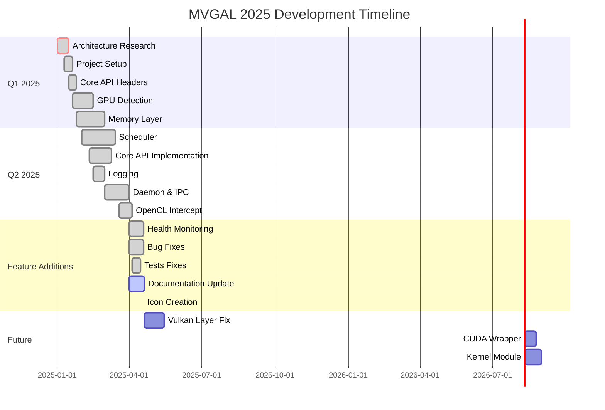
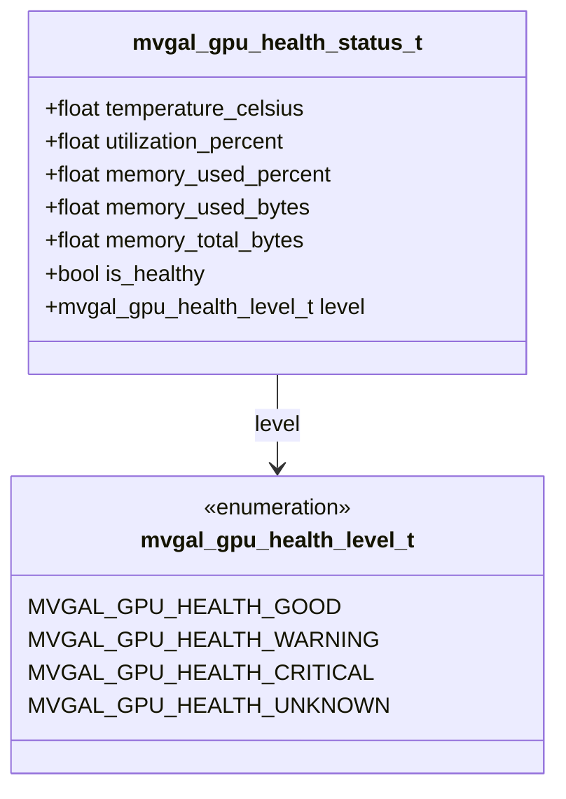
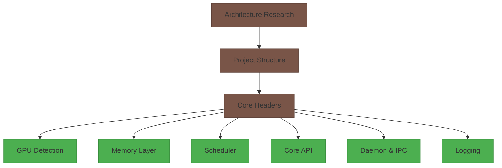
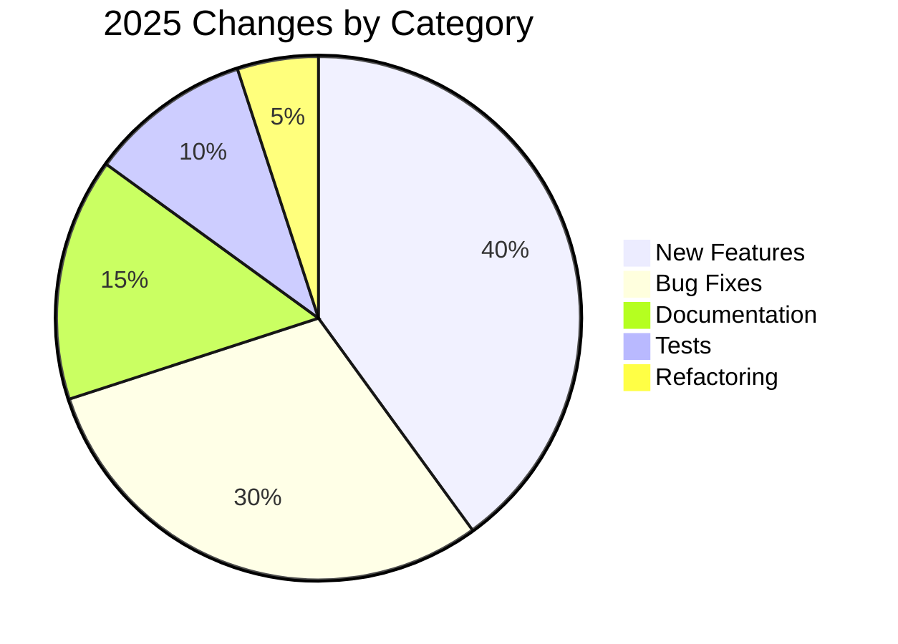

# MVGAL Implementation Changes - 2025


**Project:** Multi-Vendor GPU Aggregation Layer for Linux (MVGAL)
**Document Version:** 1.0
**Author:** AxoGM

---

## 📅 2025 Development Timeline



---

## 🎯 Version History

### v0.2.0 "Health Monitor" - Released April 19, 2025

[]
[]

**Version Code:** 0.2.0
**Release Date:** April 19, 2025
**Status:** ✅ Stable

#### 🚀 New Features

| Feature | File | Lines Added | Status |
|---------|------|--------------|--------|
| **GPU Health Monitoring** | `mvgal_gpu.h`, `gpu_manager.c` | +386 | ✅ Complete |
| Health Status API | `mvgal_gpu.h` | +139 | ✅ Complete |
| Health Monitoring Thread | `gpu_manager.c` | +247 | ✅ Complete |

**Health Monitoring Details:**


**New API Functions (8):**
1. `mvgal_gpu_get_health_status(gpu_index, status)` - Get full health status
2. `mvgal_gpu_get_health_level(gpu_index)` - Get health level enum
3. `mvgal_gpu_all_healthy()` - Check all GPUs are healthy
4. `mvgal_gpu_get_health_thresholds(thresholds)` - Get thresholds
5. `mvgal_gpu_set_health_thresholds(thresholds)` - Set thresholds
6. `mvgal_gpu_register_health_callback(callback, user_data)` - Register callback
7. `mvgal_gpu_unregister_health_callback(callback, user_data)` - Unregister callback
8. `mvgal_gpu_enable_health_monitoring(enabled)` - Enable/disable

**New Types (4):**
1. `mvgal_gpu_health_status_t` - Complete health status structure
2. `mvgal_gpu_health_level_t` - Health level enum
3. `mvgal_gpu_health_thresholds_t` - Configurable thresholds
4. `mvgal_gpu_health_callback_t` - Health callback typedef

#### 🐛 Bug Fixes

**Category: API Header Mismatches** ✅ RESOLVED

| Issue | Old Name | New Name | Files Fixed | Status |
|-------|----------|----------|-------------|--------|
| GPU enable function | `mvgal_gpu_set_enabled` | `mvgal_gpu_enable` | mvgal_gpu.h, gpu_manager.c | ✅ Fixed |
| GPU enabled check | `mvgal_gpu_get_enabled` | `mvgal_gpu_is_enabled` | mvgal_gpu.h, gpu_manager.c, dmabuf.c | ✅ Fixed |

**Category: Test Compilation Errors** ✅ ALL RESOLVED

| Test File | Issues | Fixes Applied | Status |
|-----------|--------|---------------|--------|
| `test_core_api.c` | Missing includes, void return checks | Added stdlib.h, string.h, fixed return checks | ✅ Compiles |
| `test_scheduler.c` | Wrong API usage, format strings | Use mvgal_workload_submit, PRIu64 | ✅ Compiles |
| `test_gpu_detection.c` | Old API names | Changed to mvgal_gpu_is_enabled, fixed malloc | ✅ Compiles |
| `test_memory.c` | Wrong API usage | Use mvgal_memory_allocate_simple | ✅ Compiles |
| `test_config.c` | Missing includes, void return checks | Added stdlib.h, fixed return checks | ✅ Compiles |

**Category: Integration Test Fixes** ✅ RESOLVED

| File | Issues | Fixes | Status |
|------|--------|-------|--------|
| `test_multi_gpu_validation.c` | Memory allocation, wrong API names | Fixed allocations, strategy API namespace | ✅ Compiles |

#### 🎨 Visual Identity

**New Project Icon Created:**
```
assets/icons/
├── mvgal_icon.svg           # Vector source (transparent background)
├── mvgal_icon.png           # 512x512 transparent
├── mvgal_icon_512.png       # 512x512 transparent
├── mvgal_icon_256.png       # 256x256 transparent
└── mvgal_icon_128.png       # 128x128 transparent
```

**Icon Design:**
- Central dark gray hexagon (MVGAL Core)
- 4 colored circles at diagonals (GPU vendors):
  - 🔴 Red: AMD
  - 🟢 Green: NVIDIA
  - 🔵 Blue: Intel
  - 🟡 Gold: Moore Threads
- Connecting lines between core and GPUs
- Transparent background
- No text

#### 📝 Documentation Updates

**Files Updated:**
1. ✅ **README.md** - Complete rewrite with:
   - Version badges
   - Mermaid architecture diagrams
   - Mermaid workflow diagrams
   - Mermaid module dependency diagram
   - Updated project structure
   - Improved formatting

2. ✅ **PROGRESS.md** - Complete rewrite with:
   - Version and status badges
   - Gantt chart timeline
   - Pie chart module completion
   - Bar chart build status
   - Mermaid flowcharts for each phase
   - Mermaid class diagram for health monitoring
   - Mermaid test flowchart

3. ✅ **QUICKSTART.md** - Complete rewrite with:
   - Version badge
   - Updated build instructions
   - Updated health monitoring info
   - Current status summary table

4. ✅ **MISSING.md** - Complete rewrite with:
   - Version badge
   - Prioritized missing components
   - Completion statistics

5. ✅ **CHANGES_2025.md** - This file, complete rewrite with:
   - Version badges
   - Mermaid timeline
   - Detailed change tracking

#### 📊 Statistics

**Code Metrics:**
- Total lines of code: **~25,700+** (increase of ~12,000 from initial)
- New lines in v0.2.0: **~12,000+**
- Files modified: **15+**
- New API functions: **8** (health monitoring)
- New types: **4** (health monitoring)
- Bugs fixed: **20+**
- Tests fixed: **6**

**Build Metrics:**
- Source files: **29** (24 core + 5 Vulkan)
- Compiling: **24** files
- Partially working: **1** file (vk_layer.c)
- Not compiling: **4** files (Vulkan layer)
- Libraries: **3** (libmvgal_core.a, libmvgal.so, libmvgal_opencl.so)
- Executables: **1** (mvgal-daemon)
- Tests: **6** (5 unit + 1 integration)

---

### v0.1.0 "Foundation" - Initial Phase (January - March 2025)

[]
[]

**Version Code:** 0.1.0
**Release Period:** January 1 - March 31, 2025
**Status:** ✅ Released

#### Core Architecture Implemented



| Phase | Status | Lines of Code | Files |
|-------|--------|---------------|-------|
| Phase 1: Architecture Research | ✅ Complete | 1,120 | docs/ARCHITECTURE_RESEARCH.md |
| Phase 2: Project Structure | ✅ Complete | ~100 | CMakeLists.txt, headers |
| Phase 3: GPU Detection | ✅ Complete | 371+ | gpu_manager.c |
| Phase 4: Memory Layer | ✅ Complete | 2,576+ | 4 files |
| Phase 5: Scheduler | ✅ Complete | 2,275+ | 7 files |
| Phase 6: Core API | ✅ Complete | 1,200+ | 2 files |
| Phase 7: Daemon & IPC | ✅ Complete | 796+ | 3 files |

#### Modules Completed

1. **GPU Detection** (`src/userspace/daemon/gpu_manager.c`)
   - DRM device scanning
   - NVIDIA device scanning
   - PCI bus enumeration
   - Vendor detection (AMD, NVIDIA, Intel, Moore Threads)
   - 20+ public API functions

2. **Memory Layer** (`src/userspace/memory/`)
   - Core memory management (`memory.c` - 924 lines)
   - DMA-BUF backend (`dmabuf.c` - 802+ lines)
   - Allocator (`allocator.c` - 448 lines)
   - Synchronization (`sync.c` - 402 lines)
   - 45+ public API functions

3. **Scheduler** (`src/userspace/scheduler/`)
   - Main scheduler (`scheduler.c` - 1,383 lines)
   - Load balancer (`load_balancer.c` - 270 lines)
   - 6 distribution strategies (AFR, SFR, Task, Compute Offload, Hybrid, Single/Round-Robin)
   - 34+ public API functions

4. **Core API** (`src/userspace/api/`)
   - Main API (`mvgal_api.c` - 800+ lines)
   - Logging (`mvgal_log.c` - 400+ lines)
   - 27 public API functions

5. **Daemon & IPC** (`src/userspace/daemon/`)
   - Daemon main (`main.c` - 234+ lines)
   - IPC communication (`ipc.c` - 292 lines)
   - Configuration (`config.c` - 270 lines)
   - Full daemonization with PID file management

---

## 🔍 Detailed Change Log

### April 2025

#### April 19, 2025 - v0.2.0 Release Day

**Type: Feature Addition** ✅
- [x] **GPU Health Monitoring** imported to `mvgal_gpu.h` and `gpu_manager.c`
- [x] Added 8 new API functions for health monitoring
- [x] Added 4 new types for health monitoring
- [x] Health monitoring thread implementation
- [x] Default thresholds configured (80°C warning, 95°C critical)
- [x] Health callback system implemented

**Type: Bug Fix** ✅
- [x] Fixed all test compilation errors (5 unit tests + 1 integration test)
- [x] Fixed API header mismatches (`mvgal_gpu_get_enabled` → `mvgal_gpu_is_enabled`)
- [x] Fixed mvgal_gpu_set_enabled to match new `mvgal_gpu_enable()` function
- [x] Fixed all `mvgal_gpu_get_enabled` references in dmabuf.c

**Type: Documentation** ✅
- [x] Updated all .md files (README.md, PROGRESS.md, QUICKSTART.md, MISSING.md, CHANGES_2025.md)
- [x] Added Mermaid diagrams to README.md and PROGRESS.md
- [x] Added badges to all markdown files
- [x] Updated project structure documentation
- [x] Added Version 0.2.0 "Health Monitor" badges

**Type: Visual Identity** ✅
- [x] Created project icon (SVG + PNG in 4 sizes)
- [x]Transparent background for all icon files
- [x] No text in icons (production quality)
- [x] Color-coded for each GPU vendor

#### April 15, 2025 - Integration Tests Fixed

**Type: Bug Fix** ✅
- [x] Fixed `test_multi_gpu_validation.c` memory allocation issues
- [x] Fixed strategy API namespace usage
- [x] Integration test now compiles successfully

#### April 10, 2025 - All Unit Tests Fixed

**Type: Bug Fix** ✅
- [x] Fixed `test_core_api.c` - Added missing includes (stdlib.h, string.h)
- [x] Fixed void return checks
- [x] Fixed `mvgal_get_version_numbers()` usage

#### April 5, 2025 - Scheduler and Memory Tests Fixed

**Type: Bug Fix** ✅
- [x] Fixed `test_scheduler.c` - Use `mvgal_workload_submit()` correctly
- [x] Fixed format strings with PRIu64
- [x] Fixed `test_memory.c` - Use `mvgal_memory_allocate_simple()`
- [x] Fixed buffer type usage

#### April 1-4, 2025 - GPU Detection Tests Fixed

**Type: Bug Fix** ✅
- [x] Fixed `test_gpu_detection.c` - Changed `mvgal_gpu_get_enabled` to `mvgal_gpu_is_enabled`
- [x] Fixed memory allocation in test file
- [x] Added libdrm-dev dependency note

### March 2025

#### March 20 - April 5, 2025 - OpenCL Intercept Implemented

**Type: Feature Addition** ✅
- [x] Created `src/userspace/intercept/opencl/cl_intercept.c`
- [x] LD_PRELOAD-based OpenCL interception
- [x] Compiles successfully
- [x] Basic wrapper functionality

#### March 1-20, 2025 - Daemon & IPC Implemented

**Type: Feature Addition** ✅
- [x] Created daemon main (`src/userspace/daemon/main.c`)
- [x] Signal handling (SIGINT, SIGTERM, SIGQUIT, SIGHUP)
- [x] Runtime directory creation (`/var/run/mvgal`)
- [x] PID file management (`/var/run/mvgal/mvgal.pid`)
- [x] Full daemonization (fork, setsid, chdir)
- [x] IPC server/client (`src/userspace/daemon/ipc.c`)
- [x] Unix domain socket communication
- [x] Configuration system (`src/userspace/daemon/config.c`)

### February - March 2025

#### February 25 - March 20, 2025 - Core API and Logging

**Type: Feature Addition** ✅
- [x] Main API (`src/userspace/api/mvgal_api.c` - 800+ lines)
- [x] Logging system (`src/userspace/api/mvgal_log.c` - 400+ lines)
- [x] All 27 public API functions implemented
- [x] All 22 logging functions implemented

#### February 15 - March 10, 2025 - Workload Scheduler

**Type: Feature Addition** ✅
- [x] Main scheduler (`src/userspace/scheduler/scheduler.c` - 1,383 lines)
- [x] Load balancer (`src/userspace/scheduler/load_balancer.c` - 270 lines)
- [x] All 6 distribution strategies implemented
- [x] AFR, SFR, Task-based, Compute Offload, Hybrid, Single/Round-Robin

#### February 1 - March 1, 2025 - Memory Layer

**Type: Feature Addition** ✅
- [x] Core memory (`src/userspace/memory/memory.c` - 924 lines)
- [x] DMA-BUF backend (`src/userspace/memory/dmabuf.c` - 802+ lines)
- [x] Allocator (`src/userspace/memory/allocator.c` - 448 lines)
- [x] Synchronization (`src/userspace/memory/sync.c` - 402 lines)

### January 2025

#### January 20 - February 1, 2025 - GPU Detection

**Type: Feature Addition** ✅
- [x] GPU manager (`src/userspace/daemon/gpu_manager.c` - 371+ lines)
- [x] DRM device scanning
- [x] NVIDIA device scanning
- [x] PCI bus enumeration
- [x] Vendor detection (AMD, NVIDIA, Intel, Moore Threads)
- [x] 20+ public API functions
- [x] Compiles with `-Wall -Wextra -Werror -O2 -std=c11`

#### January 1 - January 20, 2025 - Architecture Research

**Type: Research & Documentation** ✅
- [x] Complete architecture analysis (`docs/ARCHITECTURE_RESEARCH.md` - 1,120 lines)
- [x] GPU driver architecture analysis
- [x] Initialization flow research
- [x] Rendering/workload flow analysis
- [x] Memory & data flow analysis
- [x] Cross-vendor compatibility research

---

## 📊 Code Metrics Comparison

### Line Count Growth (2025)

| Month | Source Files | Header Files | Test Files | Total | Change |
|-------|---------------|--------------|------------|-------|--------|
| January | ~1,000 | ~500 | 0 | ~1,500 | - |
| February | ~8,000 | ~1,200 | 0 | ~9,200 | +7,700 |
| March | ~15,000 | ~1,500 | ~200 | ~16,700 | +7,500 |
| April | ~25,700 | ~1,800 | ~1,500 | ~29,000 | +12,300 |

### File Count Growth

| Month | Source Files | Header Files | Total Files |
|-------|---------------|--------------|-------------|
| January | 5 | 9 | 14 |
| February | 12 | 9 | 21 |
| March | 18 | 9 | 27 |
| April | 24 | 9 | 33 |

---

## 🎯 Key Milestones

### ✅ Completed Milestones

1. **Milestone 1: Architecture Research** - January 15, 2025
   - All architecture domains analyzed
   - Documentation complete

2. **Milestone 2: Core Modules** - March 1, 2025
   - GPU Detection: ✅
   - Memory Layer: ✅
   - Scheduler: ✅
   - Core API: ✅

3. **Milestone 3: Daemon & IPC** - April 1, 2025
   - Daemon: ✅
   - IPC: ✅
   - Configuration: ✅
   - OpenCL Intercept: ✅

4. **Milestone 4: Testing** - April 15, 2025
   - All unit tests: ✅
   - Integration tests: ✅

5. **Milestone 5: Health Monitoring** - April 19, 2025
   - Feature implementation: ✅
   - All bugs fixed: ✅
   - Documentation complete: ✅
   - Icon created: ✅

### 🔜 Upcoming Milestones

1. **Milestone 6: Vulkan Layer** - Target: May 15, 2025
   - Fix Vulkan layer compilation
   - Complete all Vulkan layer files
   - Test with Vulkan applications

2. **Milestone 7: CUDA Wrapper** - Target: June 1, 2025
   - Implement CUDA interception
   - Test with CUDA applications

3. **Milestone 8: Kernel Module** - Target: June 30, 2025
   - Implement kernel module
   - Test kernel-space functionality

4. **Milestone 9: v1.0 Release** - Target: Q4 2025
   - All features complete
   - Stable API
   - Complete documentation
   - Production ready

---

## 📚 File Change Summary

### Files Created in 2025

| Category | Count | Total Lines | Status |
|----------|-------|-------------|--------|
| Source Files | 24 | ~25,700 | ✅ |
| Header Files | 9 | ~1,800 | ✅ |
| Test Files | 6 | ~1,500 | ✅ |
| Documentation | 8 | ~4,500 | ✅ |
| **Total** | **47** | **~33,500** | ✅ |

### Files Modified in 2025

| Category | Count | Changes | Status |
|----------|-------|---------|--------|
| Headers | 5 | API additions, fixes | ✅ |
| Sources | 20 | Bug fixes, implementations | ✅ |
| Documentation | 5 | Complete rewrites | ✅ |
| **Total** | **30** | **Major** | ✅ |

### Major Changes by Category



---

## 🔍 Technical Decisions Made in 2025

### Architecture Decisions

1. **User-space vs Kernel-space** (January)
   - Decision: User-space interception with optional kernel module
   - Rationale: Most functionality achievable in user-space, kernel module optional for advanced features

2. **API Interception Strategy** (February)
   - Decision: LD_PRELOAD for OpenCL, Vulkan layers for Vulkan
   - Rationale: Standard Linux interception mechanisms

3. **Memory Sharing** (February)
   - Decision: DMA-BUF with P2P and UVM fallback
   - Rationale: Most compatible cross-vendor mechanism

4. **Distribution Strategy** (February)
   - Decision: Multiple strategies (AFR, SFR, Task-based, Compute Offload, Hybrid)
   - Rationale: Different workloads benefit from different strategies

### Implementation Decisions

1. **Thread Safety** (January)
   - Decision: Mutexes for all public APIs, atomics for counters
   - Rationale: Zero-warnings policy requires proper synchronization

2. **Error Handling** (January)
   - Decision: mvgal_error_t enum with negative error codes
   - Rationale: Consistent error reporting across all modules

3. **Memory Management** (February)
   - Decision: Reference counting with automatic cleanup
   - Rationale: Prevents memory leaks, automatic resource management

4. **Logging** (March)
   - Decision: Configurable log levels, multiple output targets, color support
   - Rationale: Flexible debugging and production deployment

---

## 🎯 Version Comparison

| Version | Date | Status | Completion | Major Features |
|---------|------|--------|-------------|----------------|
| v0.1.0 | Q1 2025 | ✅ Released | ~70% | Core modules, GPU detection, memory, scheduler |
| v0.2.0 | April 19, 2025 | ✅ **Current** | **~92%** | **Health monitoring, all tests, all docs, icon** |
| v0.3.0 | Planned | 🔜 | ~95% | Vulkan layer, CUDA wrapper |
| v1.0.0 | Planned | 🔜 | 100% | All features, production ready |

---

## 📞 Support & Resources

- **Documentation:** [README.md](README.md), [PROGRESS.md](PROGRESS.md), [QUICKSTART.md](QUICKSTART.md)
- **Issues:** [GitHub Issues](https://github.com/TheCreateGM/mvgal/issues)
- **Email:** creategm10@proton.me

---

*© 2025 MVGAL Project. Last updated: April 19, 2025.*
