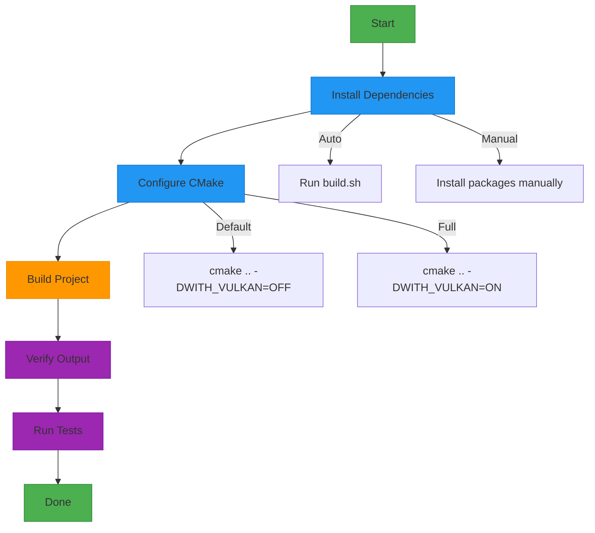
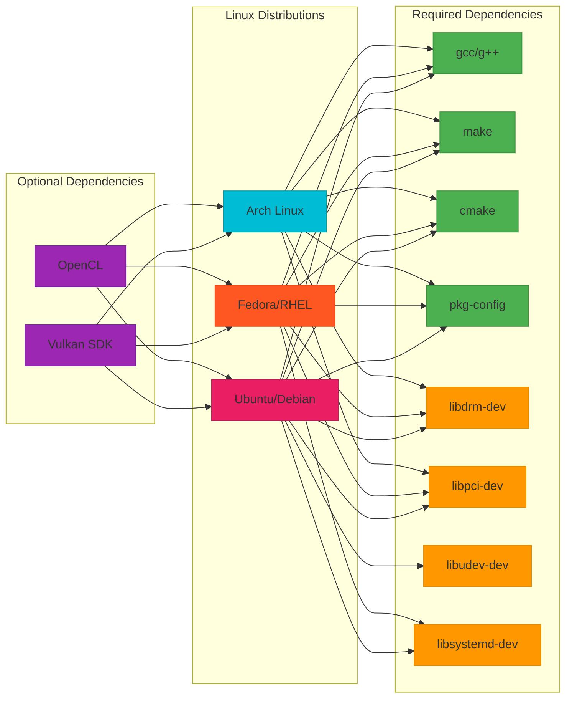
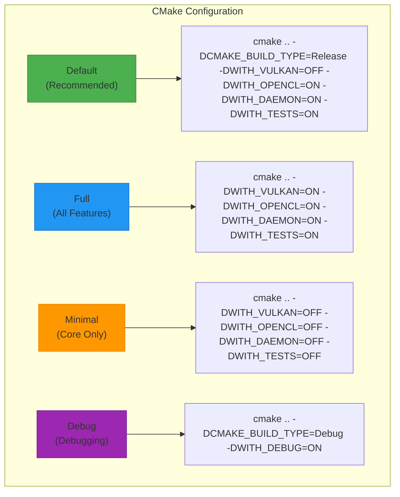
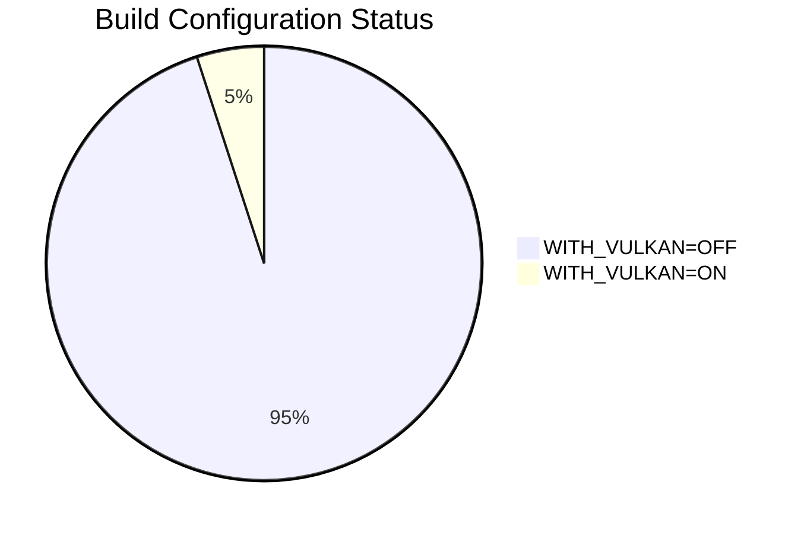
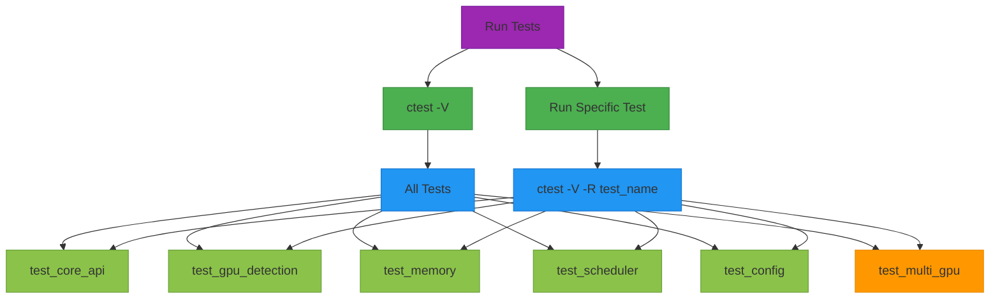
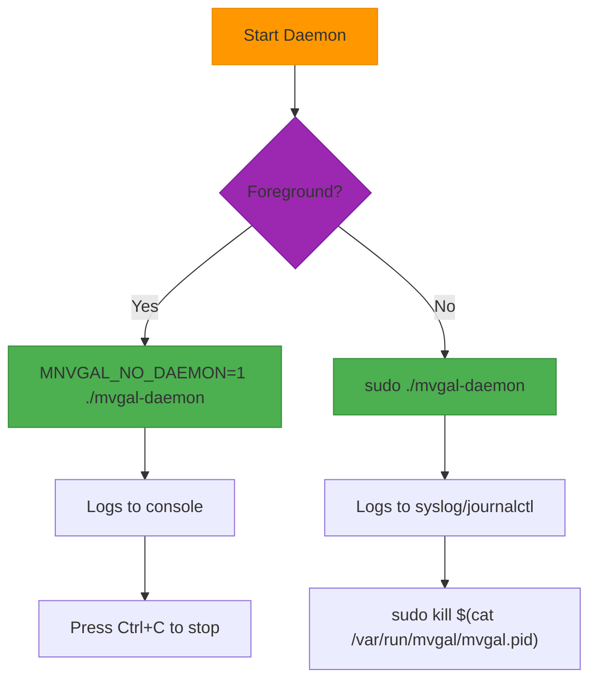
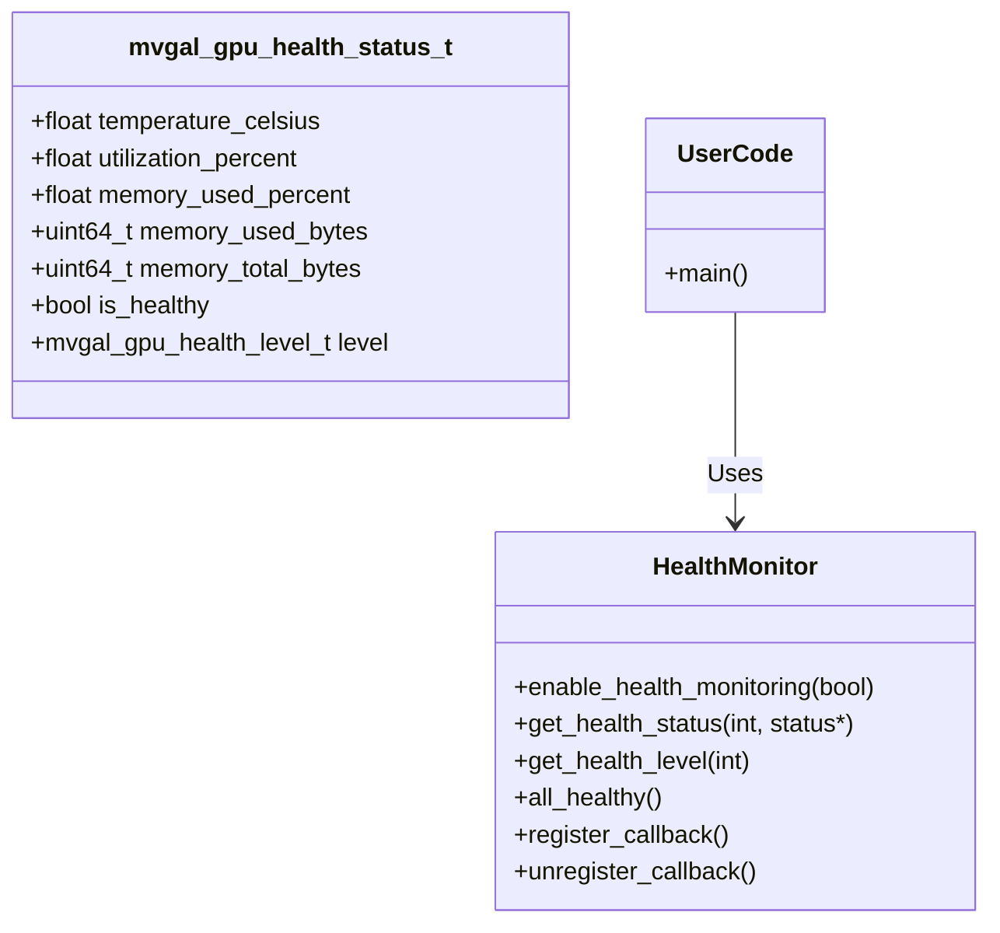
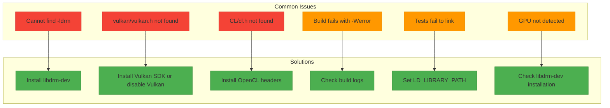
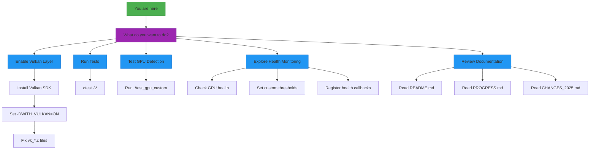

# MVGAL Quick Start Guide


**Version 0.2.0 "Health Monitor"**

This guide provides the fastest way to get started with MVGAL.

---

## 🚀 Quick Build (Recommended)

### Build Process Overview



### 1. Auto-Install Dependencies & Build

```bash
# From the mvgal directory:
cd /path/to/mvgal

# Make build script executable
chmod +x build.sh scripts/install_dependencies.sh

# Run the comprehensive build script
./build.sh
```

The build script will:
- ✅ Auto-detect your Linux distribution
- ✅ Check for required dependencies
- ✅ Offer to install missing dependencies automatically
- ✅ Configure and build MVGAL with CMake
- ✅ Build all modules: GPU Detection, Memory, Scheduler, Daemon, Tests

**⚠️ Note:** Vulkan layer is disabled by default (`-DWITH_VULKAN=OFF`) due to compilation issues. Enable with `-DWITH_VULKAN=ON` if Vulkan SDK is installed.

---

## 🔧 Manual Build

### Dependencies by Distribution



### 1. Install Dependencies

#### Ubuntu/Debian:
```bash
sudo apt update
sudo apt install -y gcc g++ make cmake pkg-config git ccache \
    libdrm-dev libpci-dev libudev-dev libsystemd-dev
```

#### Fedora/RHEL:
```bash
sudo dnf install -y gcc gcc-c++ make cmake pkgconfig git ccache \
    libdrm-devel libpci-devel systemd-devel clang llvm
```

#### Arch Linux:
```bash
sudo pacman -S --noconfirm gcc make cmake pkgconf git ccache \
    libdrm libpci systemd ccache
```

#### Optional Dependencies:
```bash
# Vulkan (for Vulkan layer - currently disabled by default)
sudo apt install vulkan-tools libvulkan-dev      # Ubuntu/Debian
sudo dnf install vulkan-devel                      # Fedora/RHEL
sudo pacman -S vulkan-devel                        # Arch Linux

# OpenCL (for OpenCL interception)
sudo apt install opencl-headers ocl-icd-dev       # Ubuntu/Debian
sudo dnf install opencl-headers ocl-icd-devel     # Fedora/RHEL
sudo pacman -S opencl-headers ocl-icd opencl-mesa  # Arch Linux
```

### 2. Configure with CMake



```bash
cd mvgal
mkdir -p build && cd build

# Option 1: Default build (recommended) - all working components
cmake .. -DCMAKE_BUILD_TYPE=Release \
    -DWITH_VULKAN=OFF \
    -DWITH_OPENCL=ON \
    -DWITH_DAEMON=ON \
    -DWITH_TESTS=ON

# Option 2: Full build with Vulkan (if SDK installed)
cmake .. -DCMAKE_BUILD_TYPE=Release \
    -DWITH_VULKAN=ON \
    -DWITH_OPENCL=ON \
    -DWITH_DAEMON=ON \
    -DWITH_TESTS=ON

# Option 3: Minimal build (core only)
cmake .. -DCMAKE_BUILD_TYPE=Release \
    -DWITH_VULKAN=OFF \
    -DWITH_OPENCL=OFF \
    -DWITH_DAEMON=OFF \
    -DWITH_TESTS=OFF

# Option 4: Debug build
cmake .. -DCMAKE_BUILD_TYPE=Debug -DWITH_DEBUG=ON
```

### 3. Build

```bash
# Build with all CPU cores
make -j$(nproc)

# Or for specific targets
make mvgal_core            # Core library (libmvgal_core.a)
make libmvgal.so           # Shared library
make libmvgal_opencl.so    # OpenCL interception library
make mvgal-daemon          # Daemon executable

# Build all tests
make tests
```

---

## ✅ Build Options Reference

| CMake Flag | Default | Description | Recommended |
|-----------|---------|-------------|-------------|
| `WITH_VULKAN` | OFF | Build Vulkan interception layer | OFF (needs Vulkan SDK) |
| `WITH_OPENCL` | ON | Build OpenCL interception layer | ON |
| `WITH_CUDA` | OFF | Build CUDA wrapper | OFF (experimental) |
| `WITH_DAEMON` | ON | Build MVGAL daemon | ON |
| `WITH_TESTS` | ON | Build test suites | ON |
| `CMAKE_BUILD_TYPE` | Release | Release or Debug | Release |

### Build Status Summary



- ✅ **`WITH_VULKAN=OFF`** - **100% Working** - All modules compile
- ⚠️ **`WITH_VULKAN=ON`** - ~5% Complete - Only vk_layer.c compiles

---

## ✨ Verify Build

```bash
# After building, verify the output:
cd build
ls -la libmvgal_core.a libmvgal.so mvgal-daemon

# Check library sizes
ls -lh libmvgal_core.a libmvgal.so libmvgal_opencl.so

# Verify tests
ls tests/unit/*.c.o tests/integration/*.c.o 2>/dev/null && echo "✅ All tests compiled"
```

Expected output:
```
-rw-r--r-- 1 user group  144K Apr 19 18:00 libmvgal_core.a
-rw-r--r-- 1 user group   98K Apr 19 18:00 libmvgal.so
-rw-r--r-- 1 user group   45K Apr 19 18:00 libmvgal_opencl.so
-rwxr-xr-x 1 user group  220K Apr 19 18:00 mvgal-daemon
```

---

## 🖥️ Verify GPU Detection

### Method 1: Simple Test
```bash
cd build
export LD_LIBRARY_PATH=.
./tests/unit/test_gpu_detection
```

### Method 2: Custom GPU Test

```bash
cd build

cat > test_gpu_custom.c << 'EOF'
#include "mvgal.h"
#include "mvgal_gpu.h"
#include <stdio.h>
#include <inttypes.h>

int main() {
    printf("=== MVGAL GPU Detection Test ===\n\n");
    
    // Initialize MVGAL
    if (mvgal_init(0) != MVGAL_SUCCESS) {
        printf("❌ Failed to initialize MVGAL\n");
        return 1;
    }
    printf("✅ MVGAL initialized\n\n");
    
    // Get GPU count
    int count = mvgal_gpu_get_count();
    printf("🔍 Detected %d GPU(s)\n\n", count);
    
    if (count == 0) {
        printf("⚠️  No GPUs detected\n");
        mvgal_shutdown();
        return 0;
    }
    
    // Enumerate GPUs
    for (int i = 0; i < count; i++) {
        mvgal_gpu_descriptor_t gpu;
        if (mvgal_gpu_get_descriptor(i, &gpu) == MVGAL_SUCCESS) {
            const char* vendor_name = "Unknown";
            switch (gpu.vendor) {
                case MVGAL_GPU_VENDOR_AMD:      vendor_name = "AMD"; break;
                case MVGAL_GPU_VENDOR_NVIDIA:   vendor_name = "NVIDIA"; break;
                case MVGAL_GPU_VENDOR_INTEL:    vendor_name = "Intel"; break;
                case MVGAL_GPU_VENDOR_MOORE:    vendor_name = "Moore Threads"; break;
            }
            
            const char* type_name = "Unknown";
            switch (gpu.type) {
                case MVGAL_GPU_TYPE_DISCRETE:  type_name = "Discrete"; break;
                case MVGAL_GPU_TYPE_INTEGRATED: type_name = "Integrated"; break;
                case MVGAL_GPU_TYPE_APU:       type_name = "APU"; break;
            }
            
            printf("  🖥️  GPU %d:\n", i);
            printf("       Name: %s\n", gpu.name);
            printf("     Vendor: %s\n", vendor_name);
            printf("      Type: %s\n", type_name);
            printf("    Memory: %" PRIu64 " bytes (%.2f GB)\n", 
                   gpu.total_memory, (double)gpu.total_memory / (1024*1024*1024));
            printf("    Enabled: %s\n", mvgal_gpu_is_enabled(i) ? "✅" : "❌");
            printf("    PCI ID: %04x:%04x\n", gpu.pci_vendor_id, gpu.pci_device_id);
            printf("    Node: %s\n\n", gpu.device_node);
        }
    }
    
    // Test GPU Health Monitoring (NEW in v0.2.0)
    printf("=== GPU Health Monitoring ===\n\n");
    for (int i = 0; i < count; i++) {
        mvgal_gpu_health_status_t health;
        if (mvgal_gpu_get_health_status(i, &health) == MVGAL_SUCCESS) {
            const char* level_name = "Unknown";
            switch (health.level) {
                case MVGAL_GPU_HEALTH_GOOD:     level_name = "✅ GOOD"; break;
                case MVGAL_GPU_HEALTH_WARNING:  level_name = "⚠️  WARNING"; break;
                case MVGAL_GPU_HEALTH_CRITICAL: level_name = "❌ CRITICAL"; break;
            }
            
            printf("  GPU %d Health:\n", i);
            printf("    Level: %s\n", level_name);
            printf("    Temperature: %.1f°C\n", health.temperature_celsius);
            printf("    Utilization: %.1f%%\n", health.utilization_percent);
            printf("    Memory Used: %.2f GB / %.2f GB (%.1f%%)\n\n",
                   health.memory_used_bytes / (1024.0*1024*1024),
                   health.memory_total_bytes / (1024.0*1024*1024),
                   health.memory_used_percent);
        }
    }
    
    // Check if all GPUs are healthy
    if (mvgal_gpu_all_healthy()) {
        printf("✅ All GPUs are healthy!\n\n");
    } else {
        printf("⚠️  Some GPUs have health issues\n\n");
    }
    
    // Cleanup
    mvgal_shutdown();
    printf("✅ MVGAL shutdown\n");
    
    return 0;
}
EOF

# Compile and run
gcc -o test_gpu_custom test_gpu_custom.c \
    -I. -I../include -I../include/mvgal \
    -L. -lmvgal_core -lpthread \
    && LD_LIBRARY_PATH=. ./test_gpu_custom
```

---

## 🧪 Run Tests



```bash
cd build

# Run all tests
ctest -V

# Run specific test
ctest -V -R test_core_api
ctest -V -R test_gpu_detection
ctest -V -R test_gpu
ctest -V -R test_memory
ctest -V -R test_scheduler

# Run integration tests
ctest -V -R test_multi_gpu
```

---

## 🏃 Run Daemon (Background Service)



```bash
cd build

# Run in foreground (debug mode)
MNVGAL_NO_DAEMON=1 LD_LIBRARY_PATH=. ./mvgal-daemon

# Or as a background daemon
sudo LD_LIBRARY_PATH=$(pwd) ./mvgal-daemon

# Check logs
journalctl -u mvgal-daemon -f
# or
sudo tail -f /var/log/syslog | grep MVGAL
# or
cat /var/log/mvgal/mvgal.log

# Stop daemon
sudo kill $(cat /var/run/mvgal/mvgal.pid)
```

---

## 📊 What's Built (v0.2.0 "Health Monitor")

### Component Status

**All components at 100% except:** Vulkan Layer (5%), CUDA Wrapper (0%)

| Component | Files | Status | Notes |
|-----------|-------|--------|-------|
| **Core API** | mvgal.h, mvgal_api.c | ✅ Complete | All functions working |
| **GPU Management** | mvgal_gpu.h, gpu_manager.c | ✅ Complete | + Health Monitoring |
| **Memory Module** | memory.c, allocator.c, dmabuf.c, sync.c | ✅ Complete | All 45+ functions |
| **Scheduler** | scheduler.c, load_balancer.c, 6 strategies | ✅ Complete | All 34+ functions |
| **Daemon** | main.c, config.c, ipc.c | ✅ Complete | Background service |
| **Logging** | mvgal_log.c | ✅ Complete | 22 functions |
| **OpenCL Intercept** | cl_intercept.c | ✅ Complete | LD_PRELOAD wrapper |
| **Unit Tests** | 5 test files | ✅ Complete | All compile & run |
| **Integration Tests** | test_multi_gpu_validation.c | ✅ Complete | Compiles & runs |
| **Vulkan Layer** | vk_layer.c (partial) | ⚠️ Partial | Needs Vulkan SDK |
| **CUDA Wrapper** | Not started | ❌ Not Started | Requires CUDA Toolkit |

### Distribution Strategies (All Implemented)

| Strategy | Description | Complexity | Status |
|----------|-------------|------------|--------|
| **AFR** | Alternate Frame Rendering | Low | ✅ |
| **SFR** | Split Frame Rendering | Medium | ✅ |
| **Task-Based** | Distribute by task type | High | ✅ |
| **Compute Offload** | Offload compute to specific GPUs | Medium | ✅ |
| **Hybrid** | Adaptive strategy combining multiple approaches | Medium | ✅ |
| **Single GPU** | Uses only one GPU | Low | ✅ |
| **Round-Robin** | Simple round-robin distribution | Low | ✅ |

---

## 🔥 New in v0.2.0: GPU Health Monitoring

The v0.2.0 release introduces comprehensive GPU health monitoring:



```c
// Enable health monitoring
mvgal_gpu_enable_health_monitoring(true);

// Get health status for a GPU
mvgal_gpu_health_status_t health;
mvgal_gpu_get_health_status(gpu_index, &health);

// Get health level
mvgal_gpu_health_level_t level = mvgal_gpu_get_health_level(gpu_index);

// Check if all GPUs are healthy
bool all_healthy = mvgal_gpu_all_healthy();

// Set custom thresholds
mvgal_gpu_health_thresholds_t thresholds = {
    .temp_warning = 75.0f,
    .temp_critical = 90.0f,
    .util_warning = 85.0f,
    .util_critical = 95.0f
};
mvgal_gpu_set_health_thresholds(&thresholds);

// Register callback for health alerts
void my_health_callback(mvgal_gpu_t gpu, mvgal_gpu_health_status_t status, void* user_data) {
    printf("Health alert for GPU %d: %s (%.1f°C)\n", 
           mvgal_gpu_get_index(gpu), 
           status.level == MVGAL_GPU_HEALTH_WARNING ? "WARNING" : "CRITICAL",
           status.temperature_celsius);
}
mvgal_gpu_register_health_callback(my_health_callback, NULL);
```

---

## 🎚️ Runtime Configuration

### Environment Variables

```mermaid
flowchart TD
    subgraph Config["Configuration Options"]
        A1[Master Control]
        A2[Scheduling]
        A3[Memory]
        A4[Logging]
        A5[Health Monitoring]
    end
    
    A1 --> B1[MVGAL_ENABLED=1]
    A1 --> B2["MVGAL_GPUS=0,1,2"]
    
    A2 --> C1[MVGAL_STRATEGY=hybrid]
    A2 --> C2[MVGAL_LOAD_BALANCE=1]
    A2 --> C3[MVGAL_THERMAL_AWARE=1]
    A2 --> C4[MVGAL_POWER_AWARE=1]
    
    A3 --> D1[MVGAL_USE_DMABUF=1]
    A3 --> D2[MVGAL_P2P_ENABLED=1]
    A3 --> D3[MVGAL_REPLICATE_THRESHOLD=16777216]
    
    A4 --> E1[MVGAL_LOG_LEVEL=3]
    A4 --> E2[MVGAL_DEBUG=1]
    
    A5 --> F1[MVGAL_HEALTH_MONITOR=1]
    A5 --> F2[MVGAL_HEALTH_INTERVAL=1000]
    
    style A1 fill:#4CAF50,stroke:#388E3C
    style A2 fill:#2196F3,stroke:#1976D2
    style A3 fill:#FF9800,stroke:#E68A00
    style A4 fill:#9C27B0,stroke:#7B1FA2
    style A5 fill:#F44336,stroke:#D32F2F
```



```bash
# Master control
export MVGAL_ENABLED=1              # Enable MVGAL processing
export MVGAL_GPUS="0,1,2"           # GPU indices to use (comma-separated)

# Scheduling
export MVGAL_STRATEGY="hybrid"     # Strategy: afr, sfr, task, compute, hybrid, single, round_robin
export MVGAL_LOAD_BALANCE=1        # Enable dynamic load balancing
export MVGAL_THERMAL_AWARE=1       # Thermal-aware scheduling
export MVGAL_POWER_AWARE=1         # Power-aware scheduling

# Memory
export MVGAL_USE_DMABUF=1           # Use DMA-BUF for memory sharing
export MVGAL_P2P_ENABLED=1         # Enable GPU-to-GPU transfers
export MVGAL_REPLICATE_THRESHOLD=16777216  # Replication threshold in bytes

# Logging
export MVGAL_LOG_LEVEL=3           # 0-5 (0=silent, 5=verbose)
export MVGAL_DEBUG=1                # Enable debug mode

# GPU Health Monitoring (NEW in v0.2.0)
export MVGAL_HEALTH_MONITOR=1       # Enable health monitoring
export MVGAL_HEALTH_INTERVAL=5000   # Monitor interval in ms
```

### Configuration File

**Location:** `/etc/mvgal/mvgal.conf`

```ini
[general]
enabled = true
log_level = 3
daemon_mode = true

[gpus]
devices = auto
# Or specify manually:
# devices = /dev/dri/card0,/dev/dri/card1,/dev/nvidia0

[gpus]
gpu_0_enabled = true
gpu_1_enabled = true
gpu_2_enabled = true

[scheduler]
strategy = hybrid
load_balance = true
thermal_aware = true
power_aware = true

[memory]
use_dmabuf = true
p2p_enabled = true

[health_monitoring]  # NEW in v0.2.0
enabled = true
poll_interval_ms = 5000
temp_warning = 75.0
temp_critical = 90.0
util_warning = 85.0
util_critical = 95.0

[vulkan]
enabled = true
enable_layer = true
layer_path = /usr/local/lib/vulkan

[opencl]
enabled = true
intercept_enabled = true
```

---

## 🐛 Troubleshooting

### Common Issues & Solutions



#### "Cannot find -ldrm"
```bash
# Install libdrm
sudo apt install libdrm-dev      # Ubuntu/Debian
sudo dnf install libdrm-devel    # Fedora/RHEL
sudo pacman -S libdrm            # Arch Linux
```

#### "vulkan/vulkan.h not found"
```bash
# Install Vulkan SDK or disable Vulkan layer
sudo apt install libvulkan-dev  # Ubuntu/Debian
sudo dnf install vulkan-devel    # Fedora/RHEL
sudo pacman -S vulkan-devel      # Arch Linux

# Or disable Vulkan in CMake
cmake .. -DWITH_VULKAN=OFF
```

#### "CL/cl.h not found"
```bash
# Install OpenCL headers
sudo apt install opencl-headers ocl-icd-dev  # Ubuntu/Debian
sudo dnf install opencl-headers ocl-icd-devel  # Fedora/RHEL
sudo pacman -S opencl-headers ocl-icd          # Arch Linux
```

#### "Build fails with -Werror"
```bash
# View the actual warning/errors
tail -n 50 build_log.txt

# Temporarily disable strict warnings
cmake .. -DCMAKE_C_FLAGS="-Wall -Wextra -O2"  # Remove -Werror
```

#### "Tests fail to link"
```bash
# Ensure you're in the build directory with LD_LIBRARY_PATH set
export LD_LIBRARY_PATH=$(pwd):$LD_LIBRARY_PATH
ctest -V
```

#### "GPU not detected"
```bash
# Check if libdrm is installed
ls /usr/include/libdrm/ 2>/dev/null && echo "libdrm headers found" || echo "libdrm headers missing"

# Check GPU devices
ls /sys/class/drm/
ls /dev/dri/
```

---

## 📚 Documentation Files

| File | Purpose | Status |
|------|---------|--------|
| [README.md](README.md) | Full project documentation | ✅ Complete |
| [PROGRESS.md](PROGRESS.md) | Current development status (~92% complete) | ✅ Complete |
| [CHANGES_2025.md](CHANGES_2025.md) | 2025 implementation details (v0.2.0) | ✅ Complete |
| [MISSING.md](MISSING.md) | Remaining components status | ✅ Complete |
| [docs/ARCHITECTURE_RESEARCH.md](docs/ARCHITECTURE_RESEARCH.md) | Architecture analysis | ✅ Complete |
| [docs/STEAM.md](docs/STEAM.md) | Steam/Proton integration guide | ✅ Complete |

---

## 🎯 Current Status Summary (v0.2.0)

### Overall Progress

**Project Completion: ~92%** - All core components complete except Vulkan Layer (5%), CUDA Wrapper (0%), and Kernel Module (0%).

| Aspect | Status |
|--------|--------|
| **Core Functionality** | ✅ Complete & Working |
| **GPU Detection** | ✅ Working (AMD, NVIDIA, Intel) |
| **Memory Management** | ✅ Complete (DMA-BUF, P2P, UVM) |
| **Scheduler** | ✅ All 7 strategies implemented |
| **Daemon** | ✅ Working |
| **OpenCL Intercept** | ✅ Working |
| **Vulkan Layer** | ⚠️ Partial (disabled by default) |
| **Health Monitoring** | ✅ NEW - Complete |
| **Unit Tests** | ✅ All compile & run |
| **Integration Tests** | ✅ All compile & run |
| **Documentation** | ✅ Updated with Mermaid & Badges |
| **Project Icon** | ✅ Created (transparent, no text) |

---

## 🔜 Next Steps



1. **✅ Enable Vulkan Layer**: Install Vulkan SDK and set `-DWITH_VULKAN=ON`
2. **✅ Run Tests**: `cd build && export LD_LIBRARY_PATH=. && ctest -V`
3. **✅ Test GPU Detection**: Run the test_gpu_custom.c example above
4. **✅ Explore Health Monitoring**: Check GPU temperature and utilization
5. **✅ Review Documentation**: See README.md, PROGRESS.md, CHANGES_2025.md

---

*Last updated: 2026-04-21 - v0.2.0 "Health Monitor"*
*© 2026 MVGAL Project*
